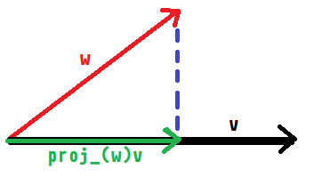

# Notes August 24, 2023 #

## Updated Aug25 ##

Hunter Herbst  
Fall 2023  
CAP4720  

## Vectors ##

Defined using a magnitude and direction, possibly also with an origin

### Notations ###

* Ordered set notation $\vec v = (x, y, z)$ or $\vec v = <x, y, z>$
* Unit vector notation $\vec v = x \hat i + y \hat j + z \hat k$
* Matix notation $\vec v = \begin{bmatrix} x \\ y \\ z \end{bmatrix}$

### Magnitude ###

$\| \vec v \| = \sqrt{v_x^2+v_y^2+v_z^2}$
$\| \vec v \| = \sqrt{\vec v \cdot \vec v}$

### Unit Vector ###

$\vec u = \frac{\vec v}{\| \vec v \|}$

### Dot Product ###

Computes the "likeness" of two vectors. For two unit vectors dotted together, $-1$ is facing opposite directions $0$ is orthagonal, and $1$ is facing the same direction.  

*Hunter side-note: Dot products with surface normals are going to be useful later, as they can be used in conjunction with a normalized vector pointing towards a scene's light source to calculate how much of that given pixel is facing the light.*

$u \cdot v = \vec u_x \vec v_x + \vec u_y \vec v_y + \vec u_z \vec v_z = \|\vec u\| \|\vec v\| cos( \theta )$

### Triangle Cosine Law ###

Refresh on the Law of Cosines from Trig.

$2ab \times cos(\theta) = a^2 + b^2 - c^2$

\pagebreak

### Projection ###

$proj_{\vec w}\vec v = \|\vec v\| cos( \theta ) \frac{\vec w}{\| \vec w \|}$  
$proj_{\vec w}\vec v = \frac{(\vec v \cdot \vec w)\vec w}{{\| \vec w \| }^2}$

  
*Diagram of $\vec w$ being projected onto $\vec v$*
